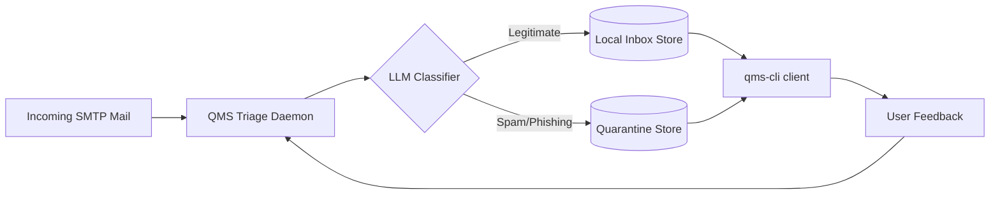

# QMS qms-cli

QMS qms-cli framework for managing server and client e-mail traffic smart way

Look, running a mail server in this day and age is a bit like running a subway system during rush hour: most of what comes through the turnstiles belongs there, but a fair amount of it is trying to shove a fake Rolex in your face or convince you that a prince overseas needs your bank details. QMS qms-cli is our answer to that problem — an open source, AI/LLM-assisted mail server and client toolkit that you drive entirely from the terminal. No dashboards, no mystery meat UI, just a CLI that tells you what it's doing and lets you get on with your day.

This document walks through what the system does, how the spam filtering and data-privacy model works, and — for the folks who want to get their hands dirty — how the project is organized so you can extend it in C++ without losing your mind.

## Table of Contents

- [What QMS Actually Does](#what-qms-actually-does)
- [The AI/LLM Triage Model](#the-aillm-triage-model)
- [Reading Your Mail from the Terminal](#reading-your-mail-from-the-terminal)
- [Blocking Spam Without Playing Whac-A-Mole](#blocking-spam-without-playing-whac-a-mole)
- [Data Collection: Yours, and Only Yours](#data-collection-yours-and-only-yours)
- [Architecture Overview](#architecture-overview)
- [Building an Accessible C++ Codebase](#building-an-accessible-c-codebase)
- [Designing the C++ CLI Interface](#designing-the-c-cli-interface)
- [Getting Started](#getting-started)
- [Contributing](#contributing)
- [License](#license)

## What QMS Actually Does

At its core, QMS qms-cli is a mail server (the piece that receives, stores, and routes messages) paired with a mail client (the piece you actually talk to) — both wired up to a locally-run or self-hosted LLM that's been put to work on one very specific job: telling the good mail from the bad mail. It's not trying to be a general-purpose chatbot bolted onto your inbox. It's a focused triage engine that:

1. Reads incoming messages the moment they land on the server.
2. Classifies each one as legitimate correspondence, marketing noise, or outright spam/phishing.
3. Surfaces the legitimate mail to you through a clean, scriptable command-line interface.
4. Quarantines or blocks the junk before it ever clutters your terminal.
5. Keeps a record of what it learned — but only about your mail, never about anyone else's.

Everything runs from the command line because, frankly, a terminal is honest. It doesn't hide what a program is doing behind a hamburger menu. When you run a QMS command, you see exactly what happened: messages fetched, messages classified, messages blocked, and why.

## The AI/LLM Triage Model

The heart of the system is a lightweight classification pipeline that sits between your mail transfer agent (MTA) and your inbox. Here's the general flow:

1. **Ingestion** — New mail arrives via SMTP and gets handed to the QMS triage daemon before it's written to any mailbox.
2. **Feature extraction** — Headers, sender reputation, SPF/DKIM/DMARC results, and the message body get bundled into a compact prompt or embedding.
3. **LLM inference** — An open source model (think something in the Llama, Mistral, or Phi family, run locally through something like `llama.cpp` or an Ollama-style runtime) scores the message for spam likelihood, phishing indicators, and general "does a human want to see this" relevance.
4. **Decision** — Based on a configurable confidence threshold, the message is tagged `inbox`, `quarantine`, or `blocked`.
5. **Learning loop** — Your own explicit corrections (marking something as "not spam" or "yes, this is spam") get folded back into a small, local fine-tuning or few-shot example set — one that lives entirely on your machine.

Because the model runs locally, your mail content never has to leave your own infrastructure to get classified. That's a deliberate design choice, not an afterthought — plenty of "AI spam filters" out there ship your email off to a third-party API, and that's a non-starter for a project built around user privacy.

## Reading Your Mail from the Terminal

The client side of QMS is a CLI you can drive interactively or wire into scripts and cron jobs. A typical session looks something like this:

```bash
# Fetch and display new legitimate mail, newest first
qms-cli inbox list --unread

# Read a specific message by its short ID
qms-cli inbox read 4f2a

# Reply right from the terminal using your default editor
qms-cli inbox reply 4f2a

# Show only messages the LLM flagged as high-confidence "important"
qms-cli inbox list --priority high

# Pipe subjects into another tool, because it's still just a CLI
qms-cli inbox list --format=json | jq '.[] | .subject'
```

The design goal here is that nothing about reading your mail should feel like a black box. Every message the CLI shows you in `inbox list` has already passed the spam/phishing check, so what you see is what you'd want to see — no more scrolling past coupon blasts to find the one email that actually matters.

## Blocking Spam Without Playing Whac-A-Mole

Traditional spam filters lean on static rule lists and Bayesian word-frequency tricks, which work right up until the spammers change three words in their template. QMS instead leans on the LLM's contextual understanding, backed by a few complementary layers:

- **Reputation checks** — Standard SPF, DKIM, and DMARC validation happen first, cheaply, before anything touches the model.
- **Semantic classification** — The LLM looks at what the message is actually trying to do (sell something, phish credentials, impersonate a known contact) rather than just keyword-matching.
- **Adaptive thresholds** — If you keep marking a certain sender's newsletter as "not spam," the system remembers that preference locally and adjusts.
- **Quarantine, not deletion** — Anything blocked goes to a quarantine store rather than the void, so you can always double-check the filter's work:

```bash
# See what got blocked this week
qms-cli spam list --since=7d

# Take a closer look at one
qms-cli spam show 91ab

# Rescue a false positive back to the inbox
qms-cli spam release 91ab

# Confirm the filter got it right, which helps it learn
qms-cli spam confirm 91ab
```

The point isn't to pretend the filter is perfect — it's to make correcting it as fast as reading the mail in the first place.

## Data Collection: Yours, and Only Yours

This is the part we take the most seriously, so let's be plain about it: **QMS only ever collects and stores data belonging to the account holder running the CLI.** It does not scrape, retain, or forward information about the other people in your conversations beyond what's strictly needed to deliver and display your own mail.

In practice, that means:

- **No cross-account data pooling.** Every QMS instance keeps its classification history, learned preferences, and quarantine store scoped to a single mailbox. There's no shared "global spam database" phoning home with your contacts' email addresses.
- **Sender metadata is ephemeral by default.** Information about a message's sender is used to render your inbox and then discarded from any long-term store unless you explicitly opt to keep it (for example, an address book entry you create yourself).
- **The learning loop trains on your feedback, not your correspondents' content.** When you mark something as spam or not-spam, QMS records the features of *that decision* — not a durable profile of the person who sent it.
- **Local-first storage.** Message bodies, classification logs, and model fine-tuning data live in your own database file or directory, encrypted at rest where the platform supports it. Nothing is uploaded to a third-party service unless you deliberately configure an external LLM API, and even then, QMS will tell you plainly before it sends a single byte off-box.
- **Right to purge.** A single command wipes your own learned data clean:

```bash
qms-cli privacy purge --confirm
```

The short version: the AI gets smarter about what *you* care about, without turning into a surveillance ledger on everyone who ever emailed you.

## Architecture Overview



- **Triage Daemon** — A long-running process (or systemd service) that owns the SMTP hook and hands messages to the classifier.
- **LLM Classifier** — A pluggable interface; ship with a local `llama.cpp`-style backend by default, but allow swapping in any OpenAI-compatible endpoint if a user explicitly wants that.
- **Local Inbox / Quarantine Stores** — Simple, inspectable storage (SQLite by default) so users can audit exactly what's kept.
- **qms-cli client** — The terminal-facing binary that reads from local stores and issues commands back to the daemon.

## Building an Accessible C++ Codebase

A lot of mail server code out there reads like it was written to be clever rather than readable, and that's exactly what we want to avoid as this project grows a C++ implementation. A few principles we're holding ourselves to:

- **Small, single-purpose translation units.** Favor a `src/` tree organized by responsibility (`smtp/`, `classifier/`, `storage/`, `cli/`) over a handful of sprawling files. If a file needs a table of contents, it's too big.
- **Modern C++ idioms, used sparingly.** Target C++20, lean on `std::optional`, `std::string_view`, and RAII for resource management, but don't reach for template metaprogramming just because it's available. Readability beats cleverness every time.
- **No naked `new`/`delete`.** Ownership should be obvious from the type signature — use `std::unique_ptr` and `std::shared_ptr` deliberately, not defensively.
- **Errors as values where it makes sense.** Prefer `std::expected`-style result types (or a small custom `Result<T, Error>`) for recoverable failures — parsing a malformed header shouldn't require throwing an exception.
- **Consistent formatting, enforced.** Ship a `.clang-format` file and a `.clang-tidy` config in the repo root, and run them in CI so nobody has to bikeshed about brace placement in a review.
- **Document the "why," not the "what."** Comments should explain protocol quirks (`// some servers send a trailing CRLF.CRLF even when...`) rather than restating the line above them.
- **Tests live next to the code they test.** A `tests/` mirror of `src/` using GoogleTest or Catch2, so anyone touching `classifier/score.cpp` immediately sees `tests/classifier/score_test.cpp`.
- **Build with CMake, and keep it boring.** A single top-level `CMakeLists.txt` that composes small per-module `CMakeLists.txt` files, with presets (`CMakePresets.json`) for debug, release, and sanitizer builds, so a new contributor can be building in one command:

```bash
cmake --preset debug
cmake --build --preset debug
ctest --preset debug
```

## Designing the C++ CLI Interface

The terminal interface deserves the same care as the classifier itself — after all, it's the only part most users ever touch directly. A few concrete recommendations for the C++ CLI layer:

- **Pick one argument-parsing library and stick with it.** `CLI11` or `cxxopts` are both solid, header-friendly choices that keep dependency sprawl down.
- **Subcommands mirror the mental model, not the implementation.** `qms-cli inbox`, `qms-cli spam`, `qms-cli privacy` — each subcommand maps to a concept the user already understands, not to whatever internal module happens to back it.
- **Consistent, scriptable output.** Every command should support `--format=table` (human-friendly, default) and `--format=json` (script-friendly), so the CLI works equally well typed by hand or piped into `jq`.
- **Exit codes that mean something.** `0` for success, distinct nonzero codes for "no results," "network error," and "user error," so shell scripts calling into `qms-cli` can branch sensibly.
- **Fail loud, fail clear.** Error messages should say what went wrong and, where possible, what to do about it — `error: cannot reach SMTP relay at 127.0.0.1:25 (connection refused). Is qms-daemon running?` beats a bare stack trace every time.
- **Man pages and `--help` are not optional.** Generate both from the same source of truth (many argument-parsing libraries can emit both), so documentation never drifts from behavior.
- **Interactive prompts should be skippable.** Anything that asks a question interactively (like confirming a purge) needs a `--yes`/`--confirm` flag for non-interactive/CI use.

## Getting Started

```bash
git clone https://github.com/your-org/qms-cli.git
cd qms-cli
cmake --preset release
cmake --build --preset release
./build/qms-cli --help
```

From there, point the daemon at your mail domain's SMTP configuration, choose a local LLM backend, and start triaging.

## Contributing

Issues and pull requests are welcome. If you're proposing a change to the classifier or the data-handling model described above, please spell out in the PR description how it preserves the "your data only" guarantee — that's a line we don't want to cross by accident.

## License

QMS qms-cli framework for managing server and client e-mail traffic smart way

Copyright (C) 2026 QMS Authors

This program is free software: you can redistribute it and/or modify
it under the terms of the GNU Affero General Public License as published
by the Free Software Foundation, either version 3 of the License, or
(at your option) any later version.

This program is distributed in the hope that it will be useful,
but WITHOUT ANY WARRANTY; without even the implied warranty of
MERCHANTABILITY or FITNESS FOR A PARTICULAR PURPOSE.  See the
GNU Affero General Public License for more details.

You should have received a copy of the GNU Affero General Public License
along with this program.  If not, see <https://www.gnu.org/licenses/>.
