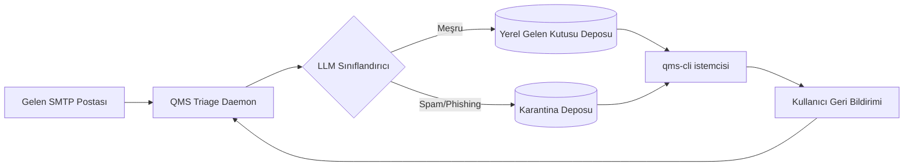

# QMS qms-cli

QMS qms-cli, sunucu ve istemci e-posta trafiğini akıllıca yönetmek için geliştirilmiş bir çerçevedir.

Buna bakın, bu günlerde bir posta sunucusu çalıştırmak, yoğun saatlerde metro hattı işletmek gibidir: içeri girenlerin çoğu oraya ait olsa da, önemli bir kısmı size sahte bir Rolex uzatmaya çalışır ya da yurtdışındaki bir prensin banka bilgilerinizi istediğini iddia eder. QMS qms-cli bunun için geliştirilmiş bir çözümdür — açık kaynaklı, yapay zekâ/LLM destekli bir posta sunucusu ve istemci araç seti. Bütün bunları tamamen terminalden yönetirsiniz. Gösterge panosu, gizemli arayüz yok; yalnızca ne yaptığını söyleyen bir CLI vardır ve işinize geri dönersiniz.

Bu belge, sistemin ne yaptığını, spam filtreleme ve veri gizliliği modelini ve — ellerini kirletmek isteyenler için — projeyi C++ ile nasıl genişletebileceğinizi anlatır; ama yine de aklınızı kaybetmeden.

## İçindekiler

- [QMS Gerçekten Ne Yapar?](#qms-gercekten-ne-yapar)
- [Yapay Zekâ/LLM Triage Modeli](#yapay-zeka-llm-triage-modeli)
- [Postanızı Terminalden Okuma](#postanizi-terminalden-okuma)
- [Spam'i Kafes Oynatmadan Engelleme](#spami-kafes-oynatmadan-engelleme)
- [Veri Toplama: Sadece Sizin Verileriniz](#veri-toplama-sadece-sizin-verileriniz)
- [Mimari Genel Bakış](#mimari-genel-bakis)
- [Erişilebilir Bir C++ Kod Tabanı Oluşturma](#erisebilir-bir-c-kod-tabanı-olusturma)
- [C++ CLI Arayüzünü Tasarlama](#c-cli-arayuzunu-tasarlama)
- [Başlangıç](#baslangic)
- [Katkıda Bulunma](#katkida-bulunma)
- [Lisans](#lisans)

## QMS Gerçekten Ne Yapar?

Temelinde QMS qms-cli, gelen e-postaları alan (alıcı, saklayan ve yönlendiren) bir posta sunucusu ile doğrudan konuştuğunuz bir e-posta istemcisinin birleşimidir; ikisi de yerel olarak çalışan veya kendi sunucunuzda barındırılan bir LLM'ye bağlıdır. Bu LLM tek ve çok özel bir göreve görevlendirilmiştir: iyi postayı kötü postadan ayırmak. Genel amaçlı bir sohbet botunun posta kutunuza eklenmesini hedeflemez. Daha çok odaklı bir önceliklendirme motorudur:

1. Gelen mesajları anında okur.
2. Her birini meşru yazışma, pazarlama gürültüsü ya da doğrudan spam/phishing olarak sınıflandırır.
3. Meşru postayı temiz, betiklenebilir bir komut satırı arayüzü aracılığıyla size sunar.
4. Gereksiz olanı karantinaya alır ya da engeller; böylece terminaliniz dağılmaz.
5. Öğrendiği bilgileri kaydeder — ama yalnızca sizin postanızla ilgili olarak, başkasının e-postası hakkında değil.

Her şey komut satırından çalışır çünkü, dürüst olmak gerekirse, terminal dürüsttür. Programın ne yaptığını hamburger menüsü arkasında gizlemez. Bir QMS komutu çalıştırdığınızda tam olarak ne olduğuna dair çıktıyı görürsünüz: mesajlar alınır, sınıflandırılır, engellenir ve neden.

## Yapay Zekâ/LLM Triage Modeli

Sistemin kalbi, posta transfer aracınız (MTA) ile gelen kutunuz arasında duran hafif bir sınıflandırma borusudur. Genel akış şöyledir:

1. **Yükleme** — Yeni e-posta SMTP üzerinden gelir ve herhangi bir posta kutusuna yazılmadan önce QMS triage daemon'una iletilir.
2. **Özellik çıkarımı** — Başlıklar, gönderen itibarı, SPF/DKIM/DMARC sonuçları ve mesaj gövdesi, kompakt bir istem veya gömme içerik halinde bir araya getirilir.
3. **LLM çıkarımı** — Açık kaynak bir model (Llama, Mistral veya Phi ailesinden bir şey düşünün; yerelde `llama.cpp` ya da benzeri bir çalışma zamanı aracılığıyla çalıştırılır) mesajı spam olasılığı, phishing göstergeleri ve genel “insan bunu görmek ister mi” uygunluğu için puanlar.
4. **Karar** — Yapılandırılabilir bir güven eşiğine göre mesaj `inbox` (gelen kutusu), `quarantine` (karantina) veya `blocked` (engellendi) olarak etiketlenir.
5. **Öğrenme döngüsü** — Kendi açıkça verdiğiniz düzeltmeler (bir şeyi “spam değil” ya da “evet bu spam” olarak işaretleme) küçük, yerel bir ince ayar veya az örnekli veri setine geri eklenir; bu set tamamen kendi makinenizde yaşar.

Model yerelde çalıştığı için, posta içeriğinizin sınıflandırma için kendi altyapınızdan çıkması gerekmez. Bu bilinçli bir tasarım seçimi, sonradan düşünülmüş bir detay değil; piyasadaki birçok “yapay zekâ spam filtresi” e-postanızı üçüncü taraf bir API'ye gönderir ve bu, kullanıcı gizliliği üzerine kurulu bir proje için kabul edilemez.

## Postanızı Terminalden Okuma

QMS'nin istemci tarafı, etkileşimli şekilde kullanabileceğiniz ya da betiklere ve cron işlerine bağlayabileceğiniz bir CLI'dır. Tipik bir oturum şu şekilde görünür:

```bash
# Yeni meşru postayı al ve en yeni önce göster
qms-cli inbox list --unread

# Kısa kimliğiyle belirli bir mesajı oku
qms-cli inbox read 4f2a

# Varsayılan editörünüzü kullanarak terminalden yanıtla
qms-cli inbox reply 4f2a

# Yalnızca LLM'nin yüksek güvenli "önemli" olarak işaretlediği mesajları göster
qms-cli inbox list --priority high

# Konuları başka bir araca aktar, çünkü bu hâlâ bir CLI
qms-cli inbox list --format=json | jq '.[] | .subject'
```

Tasarımdaki amaç, postayı okumayı bir “kara kutu” gibi hissettirmek değil. `inbox list` içinde gördüğünüz her mesaj, spam/phishing kontrolünden zaten geçmiş olduğu için gördüğünüz şey gerçekten görmek istediğiniz şeydir; kupon bombardımanının arasında gerçek anlamlı e-postayı bulmak için daha fazla aşağı kaydırmak zorunda kalmazsınız.

## Spam'i Kafes Oynatmadan Engelleme

Geleneksel spam filtreleri statik kural listelerine ve Bayesian kelime sıklığı hilelerine dayanır; bu yöntemler spamcılar üç kelimeyi değiştirene kadar işe yarar. QMS bunun yerine LLM'nin bağlamsal anlayışına dayanır; bunu birkaç tamamlayıcı katmanla birlikte kullanır:

- **İtibar kontrolleri** — SPF, DKIM ve DMARC doğrulaması önce, modelin işine girmeden, ucuz ve hızlı bir şekilde yapılır.
- **Anlamsal sınıflandırma** — LLM, mesajın gerçekten ne yapmaya çalıştığını (bir şey satmak, kimlik bilgisi çalmaya çalışmak, bilinen bir kişiyi taklit etmek) sadece anahtar kelime eşleştirmesi yerine değerlendirir.
- **Uyarlanabilir eşikler** — Belirli bir göndericinin bültenini “spam değil” olarak işaretlemeye devam ederseniz sistem bunu yerelde hatırlar ve buna göre ayarlama yapar.
- **Karantina, silme değil** — Engellenen her şey boşluğa gitmez; karantina deposuna alınır; böylece filtrenin kararını her zaman kontrol edebilirsiniz:

```bash
# Bu hafta engellenenleri gör
qms-cli spam list --since=7d

# Bir tanesine daha yakından bak
qms-cli spam show 91ab

# Yanlış pozitif bir mesajı gelen kutusuna geri al
qms-cli spam release 91ab

# Filtrenin doğru olduğunu onayla; böylece öğrenir
qms-cli spam confirm 91ab
```

Amaç filtreyi mükemmel gibi göstermek değildir; onun düzeltilmesini, postayı okumak kadar hızlı hale getirmektir.

## Veri Toplama: Sadece Sizin Verileriniz

Bu kısım en ciddiye aldığımız bölümdür; bu yüzden açıkça söyleyelim: **QMS yalnızca CLI'yi çalıştıran hesap sahibine ait verileri toplar ve saklar.** Diğer kişilerin konuşmalarına ait bilgileri, kendi postanızın teslimi ve gösterimi için gerekli olanın ötesinde kazmaz, saklamaz veya iletmez.

Uygulamada bu şu anlama gelir:

- **Hesaplar arası veri birleştirme yok.** Her QMS örneği, sınıflandırma geçmişini, öğrenilen tercihleri ve karantina deposunu tek bir posta kutusuna özel tutar. Kişilerin e-posta adreslerini telefonla dışarıya taşıyan paylaşılan “küresel spam veritabanı” yoktur.
- **Gönderen meta verisi varsayılan olarak geçicidir.** Mesajın göndereniyle ilgili bilgiler, gelen kutunuzu oluşturmak için kullanılır ve ardından uzun vadeli depolamadan atılır; yalnızca kendiniz açıkça tutmayı seçtiğiniz durumda kalır (örneğin kendi oluşturduğunuz bir adres defteri girişi).
- **Öğrenme döngüsü, karşı tarafın içeriği değil sizin geri bildiriminiz üzerine eğitilir.** Bir şeyi spam ya da spam değil olarak işaretlediğinizde QMS, o karara ait özellikleri kaydeder; gönderenin kalıcı bir profilini değil.
- **Yerel öncelikli depolama.** Mesaj gövdeleri, sınıflandırma günlükleri ve model ince ayar verileri kendi veritabanı dosyanızda veya dizininizde tutulur; platform bunu destekliyorsa dinlenmiş halde şifrelenir. Üçüncü taraf bir hizmete hiçbir şey yüklenmez; ancak istemeyerek harici bir LLM API yapılandırırsanız, QMS bunu net bir şekilde size bildirir ve tek bir baytı bile dışarı göndermeden önce onay ister.
- **Temizleme hakkı.** Tek bir komutla kendi öğrenilmiş verilerinizi temizleyebilirsiniz:

```bash
qms-cli privacy purge --confirm
```

Kısa özet: Yapay zekâ sadece sizin neye önem verdiğinizi öğrenir; kimseye ait e-postaları gözetleme defteri haline gelmez.

## Mimari Genel Bakış



- **Triage Daemon** — SMTP hook'unu sahiplenen, gelen mesajları sınıflandırıcıya teslim eden uzun ömürlü bir süreç (veya systemd servisi).
- **LLM Sınıflandırıcı** — Takılabilir bir arayüzdür; varsayılan olarak yerel bir `llama.cpp` tarzı arka uç gelir, ancak kullanıcı açıkça isterse OpenAI uyumlu herhangi bir uç noktayla değiştirilebilir.
- **Yerel Gelen Kutusu / Karantina Depoları** — Kullanıcıların tam olarak ne saklandığını denetleyebileceği basit, incelenebilir depolama alanları (varsayılan SQLite).
- **qms-cli istemcisi** — Yerel depolardan okuyan ve daemona komut gönderen terminal odaklı ikili dosya.

## Erişilebilir Bir C++ Kod Tabanı Oluşturma

Piyasadaki birçok posta sunucusu kodu, okunabilir olmak yerine “akıllı” görünmek için yazılmış gibidir; bu projede C++ uygulaması büyüdükçe tam olarak bundan kaçınmak istiyoruz. Sahip olduğumuz birkaç ilke:

- **Küçük, tek amaçlı çeviri birimleri.** `src/` ağacı sorumluluğa göre düzenlenmeli (`smtp/`, `classifier/`, `storage/`, `cli/`); birkaç devasa dosya yerine bu yaklaşım daha iyi çalışır. Bir dosyanın içindekiler tablosu gerekiyorsa, çok büyüktür.
- **Modern C++ ilkeleri, dikkatli kullanılır.** C++20 hedeflenir; kaynak yönetimi için `std::optional`, `std::string_view` ve RAII kullanılır, ama sadece çünkü mevcut olduğu için template metaprogramming'e kaçılmaz. Okunabilirlik zeka seviyesinden üstündür.
- **Çıplak `new`/`delete` yok.** Sahiplik, tip imzasından açıkça anlaşılmalıdır; `std::unique_ptr` ve `std::shared_ptr` kasıtlı kullanılmalı, savunmacı gibi değil.
- **Hatalar gerekli olduğunda değer olarak döner.** Kurtarılabilir hatalar için `std::expected` benzeri sonuç türleri (veya küçük bir `Result<T, Error>` tipi) tercih edilir; bozuk bir başlığı ayrıştırırken istisna atmak gereksiz olur.
- **Tutarlı biçimlendirme, zorunlu hale gelir.** Reponun kökünde `.clang-format` ve `.clang-tidy` yapılandırmaları bulunur ve CI içerisinde çalıştırılır; böylece code review sırasında brace yerleşimi üzerine tartışmak gerekmez.
- **“Ne” değil, “Neden” açıklanır.** Yorumlar, satırın üstünden tekrar eden ifadeler yerine protokol tuhaflıklarını açıklar (`// bazı sunucular sondaki CRLF.CRLF bile...`).
- **Testler kodla birlikte yaşar.** `src/` yapısını yansıtan bir `tests/` klasörü kullanılır; örneğin `classifier/score.cpp` dosyasına dokunulduğunda hemen `tests/classifier/score_test.cpp` görünür.
- **CMake ile kurulum, sıkıcı ama güvenli olsun.** Tek bir üst düzey `CMakeLists.txt` oluşturulur; küçük modül bazlı `CMakeLists.txt` dosyaları birleştirilir ve debug, release ve sanitizer build'ler için `CMakePresets.json` ile ön ayarlar tanımlanır; böylece yeni bir katkıda bulunan tek komutla build edebilir:

```bash
cmake --preset debug
cmake --build --preset debug
ctest --preset debug
```

## C++ CLI Arayüzünü Tasarlama

Terminal arayüzü, sınıflandırıcı kadar özen gerektirir; çünkü çoğu kullanıcı doğrudan onu kullanır. C++ CLI katmanı için birkaç somut öneri:

- **Bir argüman ayrıştırma kütüphanesi seçin ve ona sadık kalın.** `CLI11` veya `cxxopts` her ikisi de sağlam, başlık tabanlı seçenekler sunar ve bağımlılık yayılmasını azaltır.
- **Alt komutlar uygulamadan çok kullanıcı zihni modeline göre adlandırılır.** `qms-cli inbox`, `qms-cli spam`, `qms-cli privacy` — her alt komut kullanıcının zaten bildiği bir kavrama karşılık gelir; iç modül adından değil.
- **Tutarlı, betiklenebilir çıktı.** Her komut `--format=table` (insan dostu, varsayılan) ve `--format=json` (betik dostu) seçeneklerini desteklemelidir; böylece CLI hem elle yazılırken hem de `jq` ile pipe edilirken aynı şekilde çalışır.
- **Anlamlı çıkış kodları.** `0` başarı için, “sonuç yok”, “ağ hatası” ve “kullanıcı hatası” için ayrı nonzero kodlar verilir; böylece `qms-cli` çağıran kabuk betikleri doğru dallanabilir.
- **Gürültüyle değil net hata mesajlarıyla başarısız olun.** Hata mesajları neyin yanlış gittiğini ve mümkün olduğunda ne yapılması gerektiğini belirtmelidir; `error: cannot reach SMTP relay at 127.0.0.1:25 (connection refused). Is qms-daemon running?` gibi bir mesaj, çıplak bir stack trace'ten daha iyidir.
- **Man sayfaları ve `--help` seçeneği zorunludur.** Her ikisi de aynı kaynak bilgiden oluşturulmalı; bu şekilde dokümantasyon davranıştan asla sapmaz.
- **İnteraktif istemler atlanabilir olmalıdır.** Sorulan her etkileşimli onay (örneğin temizleme işlemi) için non-interactive / CI kullanımına uygun bir `--yes` / `--confirm` bayrağı gerekir.

## Başlangıç

```bash
git clone https://github.com/your-org/qms-cli.git
cd qms-cli
cmake --preset release
cmake --build --preset release
./build/qms-cli --help
```

Bundan sonra daemon'u posta alanınıza ait SMTP yapılandırmasına bağlayın, yerel bir LLM arka ucu seçin ve triage işlemine başlayın.

## Katkıda Bulunma

Sorunlar ve pull request'ler memnuniyetle kabul edilir. Sınıflandırıcı ya da yukarıda açıklanan veri işleme modeli için değişiklik öneriyorsanız, PR açıklamasında bunun “yalnızca sizin verileriniz” garantisini nasıl koruduğunu mutlaka belirtin; bu çizgiyi istemeden geçmek istemeyiz.

## Lisans

QMS qms-cli, sunucu ve istemci e-posta trafiğini akıllıca yönetmek için geliştirilmiş bir çerçevedir.

Telif Hakkı (C) 2026 QMS Yazarları

Bu program ücretsiz yazılımdır: dağıtabilir ve/veya değiştirebilirsiniz;
GNU Affero Genel Kamu Lisansı hükümlerine göre, Free Software Foundation
tarafından yayımlanan sürüm 3 ya da isterseniz sonraki bir sürüm şartlarıyla.

Bu program faydalı olması umularak dağıtılmaktadır,
ancak HİÇBİR GARANTİ VERİLMEZ; TİCARETİN KABUL EDİLMESİ ya da
BELİRLİ BİR AMACA UYGUNLUK garantisi bile dahil, açık veya örtülü.
Daha fazla ayrıntı için GNU Affero Genel Kamu Lisansı'na bakın.

Bu programla birlikte GNU Affero Genel Kamu Lisansı bir kopyasını almış
olmalısınız. Eğer almadıysanız, <https://www.gnu.org/licenses/> adresine bakın.
